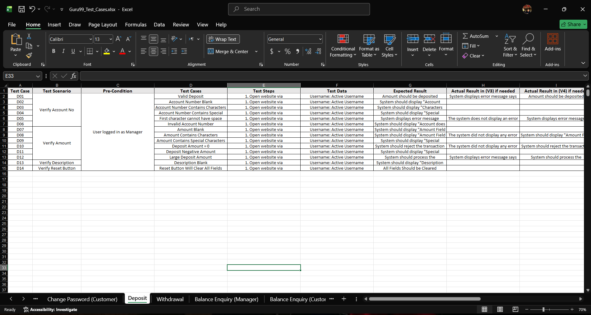

# 🏦 Guru99 Bank Application – End-to-End Manual Testing Project

> A comprehensive **Manual Testing Project** for the Guru99 Bank Application, following the complete **Software Testing Life Cycle (STLC)** from Requirement Analysis to Test Closure.

---

# 📌 Project Overview

This repository demonstrates a complete **End-to-End Manual Testing Project** for the **Guru99 Bank Application**.

The project covers all major Manual Testing activities performed in a real-world QA environment, including:

- Requirement Analysis
- Test Planning
- Test Case Design
- Test Execution
- Defect Reporting & Tracking
- Confirmation Testing
- Regression Testing
- Change Request Analysis
- Test Closure

---

# 🎯 Project Objectives

- Validate the application against business requirements.
- Design comprehensive Manual Test Cases.
- Detect and report software defects.
- Perform Confirmation & Regression Testing.
- Prepare professional QA documentation.
- Simulate a real Agile QA workflow using Jira.

---

# 🔄 Software Testing Life Cycle (STLC)

✅ Requirement Analysis

✅ Test Planning

✅ Test Case Design

✅ Test Environment Preparation

✅ Test Execution

✅ Defect Reporting

✅ Confirmation Testing

✅ Regression Testing

✅ Change Request Analysis

✅ Test Closure

---

# 📊 Project Statistics

| Metric | Result |
|:-------------------------------|------:|
| Test Cases Designed & Executed | **373** |
| Defects Reported | **144** |
| Defects Closed | **129** |
| Defect Rejection Ratio | **1.39%** |
| Test Case Effectiveness | **38.61%** |

---

# 🛠️ Tools & Technologies

- Atlassian Jira Cloud
- Agile Kanban
- Microsoft Excel
- Microsoft Word
- Google Sheets

---

# 📂 Repository Structure

```text
Guru99-Bank-Application-Manual-Testing
│
├── 📁 Bug Tracking
├── 📁 Test Cases
├── 📁 images
└── 📄 README.md
```

---

# 📁 Repository Contents

| Folder | Description |
|---------|-------------|
| 📁 Test Cases | Manual Test Cases |
| 📁 Bug Tracking | Bug Tracking Report |
| 📁 images | Project Screenshots |

---

# 📸 Project Screenshots

## 📊 QA Metrics Dashboard & Bug Reports

These screenshots present an overview of the testing metrics and defect tracking activities.

| Metrics Dashboard | Bug Reports |
|-------------------|-------------|
|  |  |

---

## 📑 Sample Manual Test Cases

The following screenshots showcase **a selection of the Manual Test Cases** designed and executed during this project.

| New Customer | Edit Customer |
|---------------|---------------|
|  |  |

| Deposit | Fund Transfer (Manager) |
|----------|-------------------------|
|  | .png) |

| Logout (Manager) |
|------------------|
| .png) |

---

# 📄 Project Deliverables

- ✔️ System Test Plan
- ✔️ Manual Test Cases
- ✔️ Bug Tracking Report
- ✔️ Change Request Analysis
- ✔️ Test Closure Report
- ✔️ Jira Project Management

---

# 💡 Skills Demonstrated

- Manual Testing
- Software Testing Life Cycle (STLC)
- Requirement Analysis
- Test Planning
- Test Case Design
- Test Execution
- Bug Reporting
- Bug Tracking
- Confirmation Testing
- Regression Testing
- Change Request Analysis
- Agile Testing
- Jira Cloud

---

# 🎯 Learning Outcomes

This project enhanced my practical knowledge of software testing by applying industry-standard QA practices throughout the complete Software Testing Life Cycle.

It also strengthened my skills in:

- Analytical Thinking
- Requirement Analysis
- Test Design
- Defect Management
- QA Documentation
- Agile Collaboration

---

# 🎥 Project Demo & Documentation

The complete project documentation, reports, and supporting files are available on Google Drive.

### 📂 Google Drive Folder

🔗 **View the Complete Project Here:**

https://drive.google.com/drive/folders/1gTb1yOgn_u8BbulUAUVT7Ax2sYDectI4?usp=drive_link

The Google Drive folder includes:

- 📄 System Test Plan
- 📑 Manual Test Cases
- 🐞 Bug Tracking Report
- 📊 Change Request Analysis
- 📋 Test Closure Report
- 📷 Additional Project Screenshots
- 🎥 Project Demo

---

# 👨‍💻 Author

## Muhammed Elgarf

**Software QA Engineer | Manual Testing | Automation Testing**

### 📬 Connect with Me

💼 **LinkedIn**

https://www.linkedin.com/in/muhammed-el-garf-798bb432a/

---

⭐ **If you found this project useful, please consider giving it a Star ⭐.**
